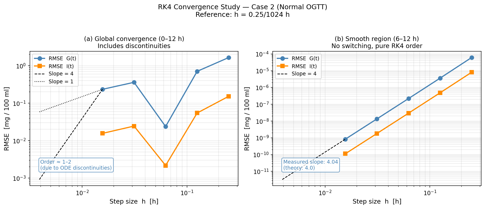
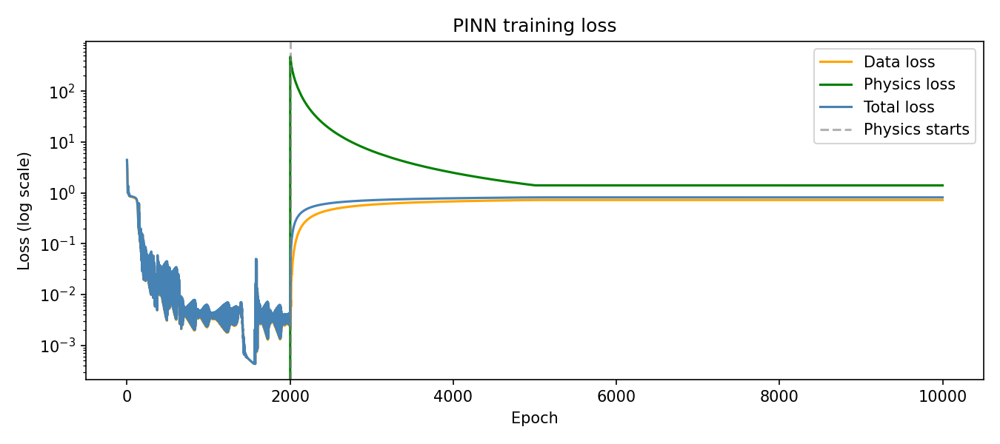

# 🩺 Modeling Glucose-Insulin Dynamics in Diabetes — OGTT Simulation

A biomedical engineering project that bridges **mathematical modeling**, **classical numerical methods**, and **physics-informed machine learning** to simulate the body's response to a glucose challenge in diabetic and healthy individuals.

---

## 🧬 What Are We Actually Modeling?

When a person drinks a glucose solution during an **Oral Glucose Tolerance Test (OGTT)**, their body triggers a cascade: glucose spikes in the bloodstream, the pancreas fires insulin in response, and — in a healthy person — everything returns to baseline within hours. In a diabetic patient, this loop is broken.

We capture this entire physiological story using just **two coupled nonlinear ODEs** (Randall's model):

**Glucose dynamics:**
$$C_g \frac{dG}{dt} = Q + I_n - G_g \cdot I \cdot G - D_d \cdot G \quad \text{(with renal removal when } G \geq G_k\text{)}$$

**Insulin dynamics:**
$$C_i \frac{dI}{dt} = -A_a \cdot I + B_b \cdot (G - G_0) \quad \text{(pancreas fires when } G \geq G_0\text{)}$$

Where `G(t)` is extracellular glucose and `I(t)` is extracellular insulin — both in mg/100 ml over a 12-hour window. The key clinical parameter is `Bb` (pancreatic sensitivity): lower Bb → hyperglycemia (Type I diabetes); higher Bb → hypoglycemia.

---

## 🔢 Three Ways to Solve the Same System

The core question of this project: **how do different computational approaches compare when solving the same biomedical ODE?**

| Approach | Method | Key Idea |
|---|---|---|
| **Classical 1** | Runge-Kutta 4 (RK4) | Fixed-step, 4th-order accuracy — the numerical workhorse |
| **Classical 2** | Adaptive RK45  | Step size adjusts to solution curvature — smarter where it matters |
| **ML/DL** | Physics-Informed Neural Network (PINN) | A neural net that learns G(t) and I(t) while obeying the ODE laws |

The PINN is trained with a composite loss: **data fidelity + physics residual**, meaning the network is penalized not just for wrong predictions, but for violating the ODEs themselves.

---

## 📊 What We Measure

We run all three solvers across **4 clinical scenarios** (normal pancreas, normal with glucose infusion, reduced sensitivity → Type I diabetes, elevated sensitivity → hypoglycemia) and compare:

- **Accuracy**: RMSE and MAE for G(t) and I(t) against a fine-step RK4 reference
- **Speed**: Wall-clock CPU time per method
- **Generalization**: Does the PINN hold up for unseen initial conditions?

---


## 🗂️ Repository Structure

```
/ode_model/          → Randall 2-ODE model definition + R reproduction of Schiesser Ch. 2
/numerical_methods/  → RK4 from scratch + adaptive scheme (Python)
/ml_dl/              → PINN architecture, loss functions, training & evaluation (PyTorch)
/results/            → CSV outputs, benchmark table, figures
/report/             → IEEE-format LaTeX report (Overleaf)
/presentation/       → Slides
/docs/               → Literature notes, GitHub Pages project page
```

---
## 📈 Sample Results

### Numerical Solver Convergence (RK4)

The figure below shows the convergence behavior of the classical 4th-order Runge–Kutta method as the step size is refined. As expected, the numerical error decreases with smaller step sizes, demonstrating the accuracy and stability of RK4 for the glucose–insulin dynamics model.



### Physics-Informed Neural Network Training

The PINN training process is monitored through the evolution of the total loss function. The decreasing loss demonstrates successful learning of the glucose–insulin dynamics while simultaneously satisfying the governing differential equations through physics-informed regularization.



These results highlight the complementary strengths of classical numerical solvers and physics-informed machine learning approaches for biomedical system modeling.

## 🧪 Model Parameters (from Schiesser 2014, Ch. 2)

| Symbol | Meaning | Normal Value |
|---|---|---|
| `G(0)` | Initial glucose | 81.14 mg/100ml |
| `I(0)` | Initial insulin | 5.671 mg/100ml |
| `Bb` | Pancreatic sensitivity | 14.3 mI/hr/mGml |
| `Gg` | Insulin-glucose control | 13.9 mG/hr/mIml/mGml |
| `Aa` | Insulin decay rate | 76 mI/hr/mIml |
| `Cg`, `Ci` | Glucose/insulin capacitance | 150 (100ml volumes) |
| `Gk` | Renal glucose threshold | 250 mGml |
| `G0` | Pancreas activation threshold | 51 mGml |

---

## 🛠️ Tech Stack

- **R** — Reproduction of original Schiesser Ch. 2 results (`deSolve`)
- **Python** — RK4 from scratch, adaptive solver (`scipy.integrate`), benchmarking
- **PyTorch** — PINN with automatic differentiation for physics residuals
- **LaTeX / Overleaf** — IEEE conference report template
- **GitHub Pages** — Live project documentation

---

## 🚀 Quick Start

### Clone the Repository

```bash
git clone https://github.com/Jana-Hazem/Diabetes-glucose-tolerance.git
cd Diabetes-glucose-tolerance
```

### Run the Numerical Methods

```bash
python numerical_methods/rk4_solver.py
python numerical_methods/scheme2_solver.py
```

### Train the Physics-Informed Neural Network (PINN)

```bash
python ml_dl/train.py
```

### Generated Outputs

After execution, simulation results, performance metrics, and figures will be saved under:

```text
results/
├── figures/
├── metrics/
└── *.csv
```

The generated outputs include numerical solver results, PINN predictions, convergence analysis, benchmarking metrics, and comparison figures used throughout the project report and presentation.
## 🔍 Key Findings

- RK4 achieved high accuracy with predictable computational cost.
- Adaptive RK45 reduced the number of integration steps while maintaining accuracy.
- The PINN successfully learned glucose-insulin dynamics while satisfying the governing ODEs.
- Physics-informed training improved generalization to unseen conditions.
- Classical solvers remained faster, while the PINN offered greater flexibility for future patient-specific modeling.

## 📚 Clinical Motivation

The OGTT has been a standard diabetes diagnostic since the 1980s. Mathematical modeling of the test lets clinicians:
- Quantify pancreatic function from a single glucose curve
- Distinguish Type I from Type II diabetes patterns
- Design personalized insulin dosing strategies

This project demonstrates that even a minimal 2-ODE model captures the essential physiology — and that both classical solvers and modern neural networks can recover the dynamics, each with different accuracy-speed trade-offs relevant to real-time clinical monitoring.


